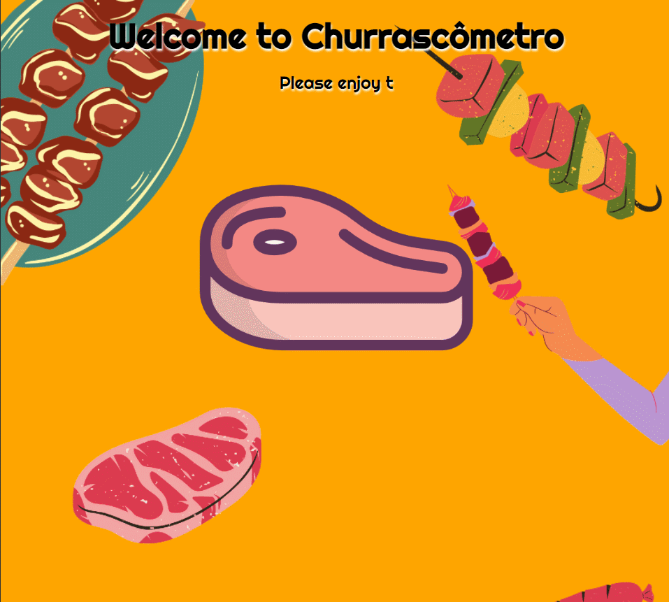
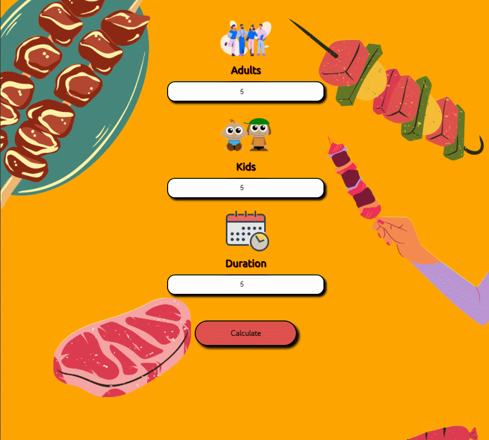

# Barbecue Calculator

### A new version of the project **"Churrascômetro"** using Jquery.

### In this project I used CSS, JavaScript and HTML.

## Please enjoy on the link below:

https://renato-dantas.github.io/barbecueCalculator

 
  
  
  

